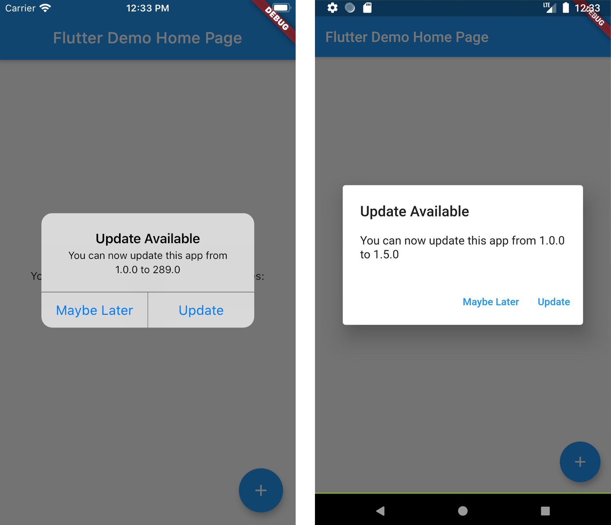

### Archive Notice
This plugin is relatively stable and feature-complete, but I won't be working on it or accepting pull requests going forward. If anyone is interested in taking over as maintainer, feel free to email me. I'm also happy to link to popular forks that have spun off. Thanks.

# New Version Plugin 🎉

A Flutter plugin that makes it possible to: 
* Check if a user has the most recent version of your app installed.
* Show the user an alert with a link to the appropriate app store page.

See more at the [Dart Packages page.](https://pub.dartlang.org/packages/new_version)



## Installation
Add new_version as [a dependency in your `pubspec.yaml` file.](https://flutter.io/using-packages/)
```
dependencies:
  new_version: ^0.3.0
```

## Usage
In `main.dart` (or wherever your app is initialized), create an instance of `NewVersion`.

`final newVersion = NewVersion();`

The plugin will automatically use your Flutter package identifier to check the app store. If your app has a different identifier in the Google Play Store or Apple App Store, you can overwrite this by providing values for `androidId` and/or `iOSId`.

*For iOS:* If your app is only available outside the U.S. App Store, you will need to set `iOSAppStoreCountry` to the two-letter country code of the store you want to search. See http://en.wikipedia.org/wiki/ISO_3166-1_alpha-2 for a list of ISO Country Codes.

You can then use the plugin in two ways.

### Quickstart
Calling `showAlertIfNecessary` with your app's `BuildContext` will check if the app can be updated, and will automatically display a platform-specific alert that the user can use to go to the app store.

`newVersion.showAlertIfNecessary(context: context);`

### Advanced 😎
If you want to create a custom alert or use the app version information differently, call `getVersionStatus`. This will return a `Future<VersionStatus>` with information about the local and app store versions of the app.
```
final status = await newVersion.getVersionStatus();
status.canUpdate // (true)
status.localVersion // (1.2.1)
status.storeVersion // (1.2.3)
status.appStoreLink // (https://itunes.apple.com/us/app/google/id284815942?mt=8)
```

If you want to present a customized dialog, you can pass your `VersionStatus` to `showUpdateDialog()`.
```
newVersion.showUpdateDialog(
  context: context, 
  versionStatus: status,
  dialogTitle: 'Custom dialog title',
  dialogText: 'Custom dialog text',
  updateButtonText: 'Custom update button text',
  dismissButtonText: 'Custom dismiss button text',
  dismissAction: () => functionToRunAfterDialogDismissed(),
)
```
=======
# new_version


## Getting started

To make it easy for you to get started with GitLab, here's a list of recommended next steps.

Already a pro? Just edit this README.md and make it your own. Want to make it easy? [Use the template at the bottom](#editing-this-readme)!

## Add your files

- [ ] [Create](https://docs.gitlab.com/ee/user/project/repository/web_editor.html#create-a-file) or [upload](https://docs.gitlab.com/ee/user/project/repository/web_editor.html#upload-a-file) files
- [ ] [Add files using the command line](https://docs.gitlab.com/ee/gitlab-basics/add-file.html#add-a-file-using-the-command-line) or push an existing Git repository with the following command:

```
cd existing_repo
git remote add origin https://gitlab.com/JoshanTandukar/new_version.git
git branch -M main
git push -uf origin main
```

## Integrate with your tools

- [ ] [Set up project integrations](https://gitlab.com/JoshanTandukar/new_version/-/settings/integrations)

## Collaborate with your team

- [ ] [Invite team members and collaborators](https://docs.gitlab.com/ee/user/project/members/)
- [ ] [Create a new merge request](https://docs.gitlab.com/ee/user/project/merge_requests/creating_merge_requests.html)
- [ ] [Automatically close issues from merge requests](https://docs.gitlab.com/ee/user/project/issues/managing_issues.html#closing-issues-automatically)
- [ ] [Enable merge request approvals](https://docs.gitlab.com/ee/user/project/merge_requests/approvals/)
- [ ] [Automatically merge when pipeline succeeds](https://docs.gitlab.com/ee/user/project/merge_requests/merge_when_pipeline_succeeds.html)

## Test and Deploy

Use the built-in continuous integration in GitLab.

- [ ] [Get started with GitLab CI/CD](https://docs.gitlab.com/ee/ci/quick_start/index.html)
- [ ] [Analyze your code for known vulnerabilities with Static Application Security Testing(SAST)](https://docs.gitlab.com/ee/user/application_security/sast/)
- [ ] [Deploy to Kubernetes, Amazon EC2, or Amazon ECS using Auto Deploy](https://docs.gitlab.com/ee/topics/autodevops/requirements.html)
- [ ] [Use pull-based deployments for improved Kubernetes management](https://docs.gitlab.com/ee/user/clusters/agent/)
- [ ] [Set up protected environments](https://docs.gitlab.com/ee/ci/environments/protected_environments.html)

***

# Editing this README

When you're ready to make this README your own, just edit this file and use the handy template below (or feel free to structure it however you want - this is just a starting point!). Thank you to [makeareadme.com](https://www.makeareadme.com/) for this template.

## Suggestions for a good README
Every project is different, so consider which of these sections apply to yours. The sections used in the template are suggestions for most open source projects. Also keep in mind that while a README can be too long and detailed, too long is better than too short. If you think your README is too long, consider utilizing another form of documentation rather than cutting out information.

## Name
Choose a self-explaining name for your project.

## Description
Let people know what your project can do specifically. Provide context and add a link to any reference visitors might be unfamiliar with. A list of Features or a Background subsection can also be added here. If there are alternatives to your project, this is a good place to list differentiating factors.

## Badges
On some READMEs, you may see small images that convey metadata, such as whether or not all the tests are passing for the project. You can use Shields to add some to your README. Many services also have instructions for adding a badge.

## Visuals
Depending on what you are making, it can be a good idea to include screenshots or even a video (you'll frequently see GIFs rather than actual videos). Tools like ttygif can help, but check out Asciinema for a more sophisticated method.

## Installation
Within a particular ecosystem, there may be a common way of installing things, such as using Yarn, NuGet, or Homebrew. However, consider the possibility that whoever is reading your README is a novice and would like more guidance. Listing specific steps helps remove ambiguity and gets people to using your project as quickly as possible. If it only runs in a specific context like a particular programming language version or operating system or has dependencies that have to be installed manually, also add a Requirements subsection.

## Usage
Use examples liberally, and show the expected output if you can. It's helpful to have inline the smallest example of usage that you can demonstrate, while providing links to more sophisticated examples if they are too long to reasonably include in the README.

## Support
Tell people where they can go to for help. It can be any combination of an issue tracker, a chat room, an email address, etc.

## Roadmap
If you have ideas for releases in the future, it is a good idea to list them in the README.

## Contributing
State if you are open to contributions and what your requirements are for accepting them.

For people who want to make changes to your project, it's helpful to have some documentation on how to get started. Perhaps there is a script that they should run or some environment variables that they need to set. Make these steps explicit. These instructions could also be useful to your future self.

You can also document commands to lint the code or run tests. These steps help to ensure high code quality and reduce the likelihood that the changes inadvertently break something. Having instructions for running tests is especially helpful if it requires external setup, such as starting a Selenium server for testing in a browser.

## Authors and acknowledgment
Show your appreciation to those who have contributed to the project.

## License
For open source projects, say how it is licensed.

## Project status
If you have run out of energy or time for your project, put a note at the top of the README saying that development has slowed down or stopped completely. Someone may choose to fork your project or volunteer to step in as a maintainer or owner, allowing your project to keep going. You can also make an explicit request for maintainers.
